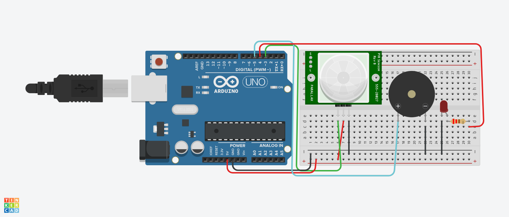

 # Alarme com sensorPIR é Buzzer.

## E esse código faz com que o o detector, quando detecta algum movimento faz o buzzer emitir um son
é o led vermelho acender.

# Componentes Usados
- 1 Arduino uno
- 1 Placa de ensaio pequena
- 1 Buzzer
- 1 Ressistor
- 1 Led
- 11 Fios

# Explicação de Código
Esse dispositivo é um alarme sonoro, que quando detecta algo a sua frente dispara o buzzer é o led vermelho. 
