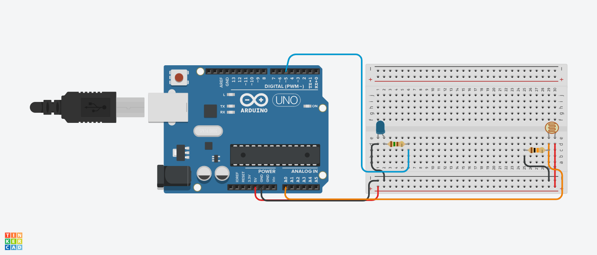

# Poste inteligente

## Este projeto foi desenvolvido dentro do tinkercard, na disciplina de Internet das Coisas (IOT), para a criação de um prototipo com arduino que
ao entardecer do dia, o poste aciona o led.

# Componentes Usados
- Oito fios
- 1 fotoressistor
- 2 resistor
- 1 led
- 1 Arduino Uno
- 1 Uma placa de ensaio pequena
  
  

  # Explicação
  O fotoressistor detecta a intensidade da luz ambiente, caso esteja escurecendo, ele aciona o led.
