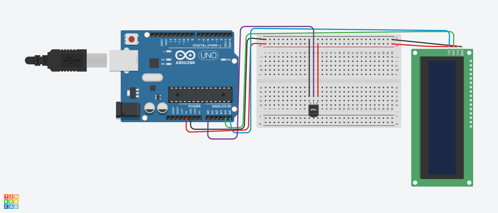

## Sensor de Temperatura LCD

## Este projeto foi desenvolvido dentro do tinkercard, na disciplina de Internet das Coisas (IOT), para a criação de um prototipo com arduino que
dependendo da temperatura do ambiente mostra ao usuario um número correspondente.

# Componentes Usados 
- 9 Fios.
- 1 Sensor de temperatura.
- 1 Tela LCD 16x2 (I2C)
- 1 Placa de ensaio pequena.
- 1 Aduino.

- 

  # Explicação
  O sensor detecta a temperatura ambiente e dependendo dela, e informado o valor em graus Celsius no LCD. 
 
