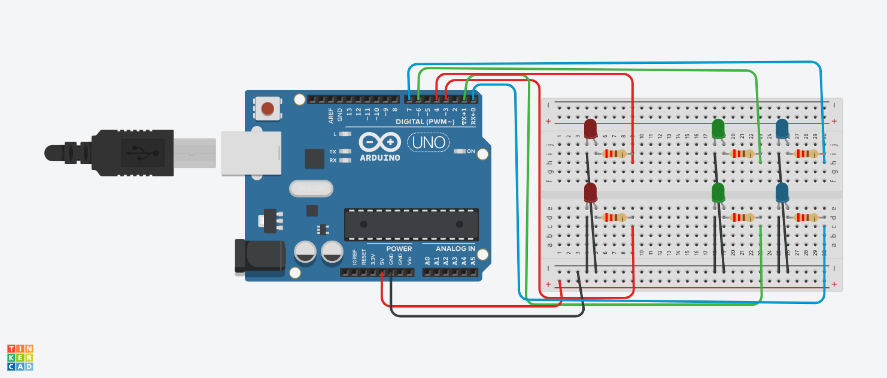

#Projeto de LEDs que apagam é acendem

este projeto foi desenvolvido dentro do tinkercard, na disciplina de Internet das Coisas
(IOT), para a criação de um prototipo com arduino que acende uma quantidade x de LEDs 
com forme os outros apagam

# Componentes Usados
- Arduino Uno (1).
- Placa de Ensaio Peequena (1).
- LEDs (6).
- Resistor (6).
- (8) Jumpers Macho-Fêmea.

  ##
  

  ## Explicação do Código
  - Primeiro Cria uma variavel int para cada LED
  - Em seguida Acende o led verde, vermelho, azul
  - Depois espera 5 segundos, após os 5 segundos
  - os leds 2 AZUIS E 2 VERDES, espera mais 5 segundos
  - em seguida acende os LEDs 1 VERDE , 2 VERMELHOS E 1 AZUL
  - espera 10 segundos repete os loop.
